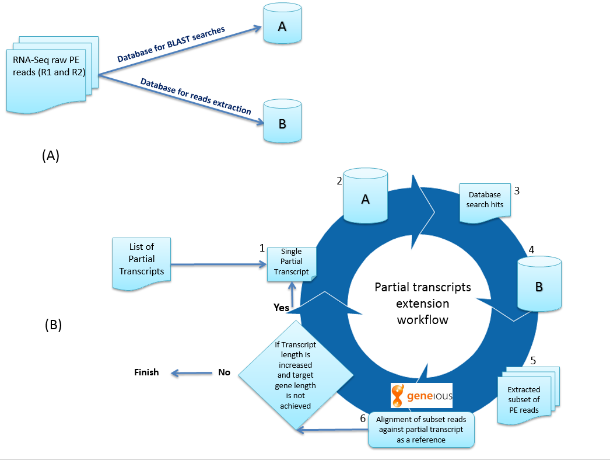

## Extension of partial transcripts using simulated reads
### Data sets
1. Reads with constant coverage
2. Reads with variable coverage

### Reference used:
CYP12C1 (NM_001300180.1)
CYP4G1 (NM_080292.4)
CYP9B2 (NM_078922.4)

### Reads simulator
https://github.com/zstephens/neat-genreads

### Dataset 1 (reads with average coverage of 50 through out gene)
```
python ./neat-genreads/genReads.py -r CYP12C1.fasta -R 100 -o constant_cov --pe 250 30 -c 50
python ./neat-genreads/genReads.py -r CYP4G1.fasta -R 100 -o constant_cov --pe 250 30 -c 50
python ./neat-genreads/genReads.py -r CYP9B2.fasta -R 100 -o constant_cov --pe 250 30 -c 50

```
### Dataset2 (reads with variable coverage. Sites were provided using a bed file)
```
python ./neat-genreads/genReads.py -r CYP12C1.fasta -R 100 -o one --pe 250 30 -c 10
python ./neat-genreads/genReads.py -r CYP12C1.fasta -R 100 -o two --pe 250 30 -c 100 -t cyp12c1.bed
cat two.read1.fastq >> one.read1.fastq
cat two.read2.fastq >> two.read2.fastq
```
```
python ./neat-genreads/genReads.py -r CYP4G1.fasta -R 100 -o one --pe 250 30 -c 10
python ./neat-genreads/genReads.py -r CYP4G1.fasta -R 100 -o two --pe 250 30 -c 100 -t cyp4g1.bed
cat two.read1.fastq >> one.read1.fastq
cat two.read2.fastq >> two.read2.fastq
```
```
python ./neat-genreads/genReads.py -r CYP9B2.fasta -R 100 -o one --pe 250 30 -c 10
python ./neat-genreads/genReads.py -r CYP9B2.fasta -R 100 -o two --pe 250 30 -c 100 -t cyp9b2.bed
cat two.read1.fastq >> one.read1.fastq
cat two.read2.fastq >> two.read2.fastq
```
### Extension workflow



## Results
### CYP12C1


### CYP4G1


### CYP9B2


### NOTE: For the CYP4G1 and CYP9B2 targeted results, I stopped at round 10. There was a possibility of further extension up to complete gene length.


